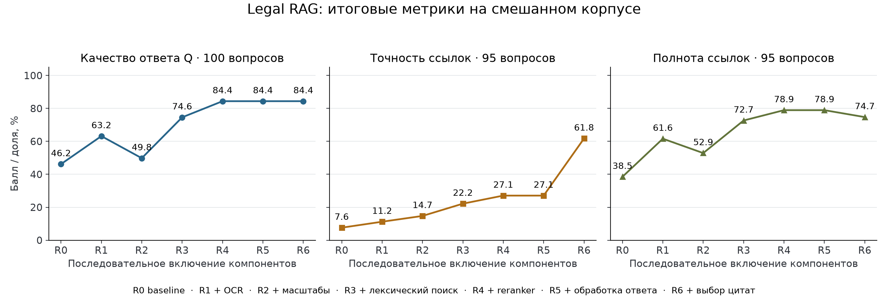
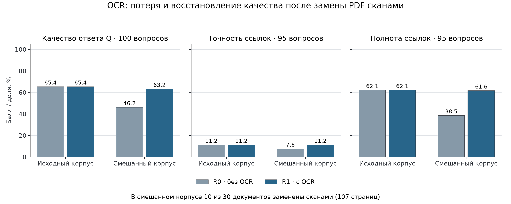

# Спецификация исследования: построение Legal RAG

Статус: все девять экспериментальных условий завершены. Получены ответы и оценки для 900 пар «вопрос — условие», сформированы итоговые метрики, графики и выводы по H1–H6.

Документ фиксирует согласованную постановку, выполненную методологию и результаты исследования. Он служит основой для дальнейшего текста научной работы и постера. Сохраняются три обязательные секции: «Гипотеза», «Методология», «Результаты».

Исходная система: [Legal-RAG-Challenge](https://github.com/SteinVR/Legal-RAG-Challenge). Формальные требования к постеру: [Poster-Examination-Guidelines.md](../../Poster-Examination-Guidelines.md). Административные условия сдачи не входят в объём этой спецификации.

## 1. Гипотеза

### 1.1. Введение и цель

Цель работы — построить достоверный RAG для работы с юридическими документами и экспериментально обосновать выбор его компонентов.

RAG формирует ответ на основе найденных фрагментов документов. Для юридического корпуса необходимо прочитать исходные PDF, найти сведения, достаточные для ответа, правильно использовать их и указать страницы-источники. В работе исследуется весь этот пайплайн: обработка документов, поиск, подготовка ответа и цитирование.

Основной исследовательский вопрос: **как построить Legal RAG, который даёт качественные ответы и полные, точные ссылки на источники?**

Для ответа сравниваются простейший RAG baseline и конфигурации с последовательным добавлением компонентов текущей системы. Исследовательский вклад — измеренный эффект этих добавлений на выбранном юридическом корпусе.

Во введении итоговой работы необходимо кратко описать задачу и особенности корпуса. Подблок исследовательского контекста должен связать выбранные решения с академическими работами по RAG, юридическому поиску и оценке цитирования. Описание архитектуры и экспериментальные подробности относятся к методологии.

### 1.2. Проверяемые гипотезы

| Гипотеза | Проверяемое предположение |
| --- | --- |
| **H1 — OCR** | OCR улучшает качество ответов и полноту ссылок на документах без текстового слоя по сравнению с обработкой без OCR. |
| **H2 — Представление документов** | Разбиение документов на фрагменты разных масштабов улучшает качество ответов и полноту ссылок относительно единственного фиксированного размера. |
| **H3 — Гибридный поиск** | Добавление лексического поиска к семантическому улучшает качество ответов и полноту ссылок. |
| **H4 — Повторное ранжирование** | Повторное ранжирование найденных фрагментов улучшает качество ответов. |
| **H5 — Обработка по типу ответа** | Обработка и валидация с учётом типа ответа повышают средний балл структурированных ответов. |
| **H6 — Цитирование** | Отдельный выбор страниц для цитирования повышает точность ссылок; его влияние на полноту проверяется экспериментально. |

Гипотезы задают ожидаемые эффекты, а не готовые выводы. Отсутствие улучшения или ухудшение метрик также является результатом исследования.

## 2. Методология

### 2.1. Корпус и разметка

Основой служит используемый в текущем Legal RAG набор: 30 юридических PDF DIFC, 590 страниц и 100 вопросов. Для 95 вопросов имеются эталонные страницы источников. Качество ответов оценивается на 100 вопросах; precision и recall ссылок — на 95 вопросах с непустой страничной разметкой.

Документы и вопросы взяты из warmup-набора исходного проекта. Эталонные ответы и рубрика оценки восстановлены из его ветки `dev`, коммит `0f01e97d2982172367ef915724c5308bdb2690e4`; эталонные страницы сверены с сохранённым журналом исходного запуска. Исходные документы и разметка сохраняются неизменными. Этот набор уже использовался при разработке системы, поэтому эксперимент оценивает компоненты на знакомом benchmark, а не обобщение на независимую тестовую выборку.

### 2.2. Подготовка искусственных сканов

Используются две версии корпуса:

- **Исходный корпус** — оригинальные PDF.
- **Смешанный корпус** — копия исходного корпуса, в которой выбранная часть документов заменена PDF из изображений страниц без текстового слоя.

До сравнительных запусков случайно выбраны 10 из 30 документов (seed `20260920`, выбор из отсортированного списка). Их 107 страниц растеризованы при 300 DPI без текстового слоя. Выбор затрагивает эталонные страницы 52 вопросов. Сохранены содержание, порядок и номера страниц, а также идентификаторы документов. Список файлов и SHA-256 оригиналов и сканов записаны в manifest эксперимента.

Для основного эксперимента достаточно чистой растеризации. Дополнительное ухудшение качества сканов не входит в обязательный объём работы.

Для каждой версии корпуса строятся собственные производные данные и индексы. В смешанный корпус не должны попадать текст или индексы оригинальных версий заменённых документов. Проверяется отсутствие извлекаемого текстового слоя в искусственных сканах. Вариант без OCR работает с оставшимся доступным текстом; вопросы, затронутые потерей текста, не исключаются из оценки.

### 2.3. Конфигурации пайплайна

| Конфигурация | Состав | Проверка |
| --- | --- | --- |
| **R0 — Baseline** | Извлечение текстового слоя PDF → фиксированные текстовые фрагменты → семантический поиск → генерация ответа. Ссылки наследуются от использованного контекста. | Отправная точка |
| **R1** | R0 + OCR для страниц, требующих распознавания. | H1 |
| **R2** | R1 + представления текста разных масштабов вместо единственного фиксированного размера. | H2 |
| **R3** | R2 + лексический поиск и объединение результатов лексического и семантического поиска. | H3 |
| **R4** | R3 + повторное ранжирование найденных кандидатов. | H4 |
| **R5** | R4 + обработка и валидация с учётом типа ответа. | H5 |
| **R6 — Полный исследуемый пайплайн** | R5 + отдельный выбор страниц для цитирования с учётом сформированного ответа. | H6 |

Каждая конфигурация наследует предыдущую. Идентификаторы документов и номера страниц сохраняются уже в baseline. Общая схема выходных данных одинакова во всех вариантах; специальные операции обработки и валидации по типу ответа включаются на этапе R5.

Эксперименты реализованы в отдельной [копии проекта](../../research/legal-rag/experiments/README.md). Используются исходные модули разбиения, эмбеддингов, reranker, генерации, обработки ответов, цитирования и оценки. Точные настройки сохранены в [protocol.json](../../research/legal-rag/experiments/protocol.json).

OCR использует PP-OCRv5. Семантический поиск — Qwen3-Embedding-0.6B; повторное ранжирование — Qwen3-Reranker-0.6B. Фиксированные фрагменты содержат до 300 токенов с перекрытием 50. В R2 используются страницы, разделы, пункты, микрофрагменты и таблицы. На этапе поиска отбираются 24 кандидата; контекст ограничен 2400 токенами текста и восемью фрагментами во всех условиях. Генерация и оценка свободных ответов выполнены моделью `gpt-5.4-mini`, reasoning effort — `high`; API подтвердил snapshot `gpt-5.4-mini-2026-03-17`. Предел выходных токенов, включая reasoning, — 8192 для генерации и 4096 для оценки. Параметры модели соответствуют [официальной документации](https://developers.openai.com/api/docs/models/gpt-5.4-mini).

R5 проверяет дополнительную нормализацию, пороги уверенности и валидацию из исходного `AnsweringService`; типизированная схема генерации одинакова уже с R0. R6 включает сужение ссылок по поддержке сформированного ответа. R4–R6 используют одинаковый контекст и переиспользуют один ответ генератора, поэтому эффект обработки и цитирования не смешивается с вариативностью повторной генерации.

Локальный поиск по матрицам эмбеддингов заменяет Qdrant без замены моделей. Расширение запросов, эвристические boosts, динамические бюджеты и дополнительные PDF-парсеры одинаково отключены во всех условиях. R6 включает все шесть исследуемых блоков, но не воспроизводит каждую эвристику исторического соревновательного запуска.

### 2.4. Порядок сравнений

Основной эксперимент — последовательное включение компонентов R0 → R1 → R2 → R3 → R4 → R5 → R6 на смешанном корпусе. Каждый вариант сравнивается с предыдущим, а полный пайплайн — с baseline. Так измеряется вклад компонента именно на соответствующем этапе сборки системы.

Для анализа OCR дополнительно выполнены R0 и R1 на исходном корпусе. Сравнение позволяет измерить потерю качества после замены документов сканами и степень её восстановления с OCR. Выполнены семь конфигураций и девять экспериментальных условий.

Во всех сравнениях фиксируются:

- набор вопросов и эталонная разметка;
- модель генерации и общие настройки её вызова;
- правила оценивания;
- сопоставимый бюджет контекста в токенах;
- все параметры, не относящиеся к добавляемому компоненту.

Для каждого условия сохранены конфигурация, версия кода, ответы, ссылки и оценки по вопросам. Идентичные запросы переиспользуют сохранённый ответ. Технически неуспешные запросы повторяются с теми же настройками; сохраняется первый валидный ответ без отбора по качеству. Исторические ответы и их баллы в новые результаты не подставлялись.

### 2.5. Метрики

Используются согласованные метрики и существующая методика оценивания ответов.

**Качество ответа:**

```text
Q = 0,7 × средний балл структурированных ответов
  + 0,3 × средний балл свободных ответов
```

Это агрегированный балл качества, а не доля полностью правильных ответов. В наборе 70 структурированных и 30 свободных ответов. Оба составляющих средних сохраняются; средний балл структурированных ответов отдельно используется для проверки H5. Для каждого нового варианта оцениваются именно его ответы, включая свободные ответы.

Структурированные ответы оцениваются существующим детерминированным scorer. Для свободных ответов используется исходная рубрика: правильность, полнота, опора на найденный контекст, калибровка уверенности, ясность и релевантность; пять оценок 0/1 усредняются. Новую оценку по этой рубрике выставляет модель, которой передаются вопрос, ответ, эталон и фактический контекст без названия конфигурации. Это автоматическая оценка по исходной рубрике, а не независимая экспертная проверка. Старые баллы свободных ответов не переиспользуются.

**Точность и полнота ссылок:** для каждого вопроса сравниваются множества уникальных пар `(идентификатор документа, номер страницы)`.

```text
Precision = число выданных эталонных страниц / число всех выданных страниц
Recall    = число выданных эталонных страниц / число всех эталонных страниц
```

При пустом наборе выданных ссылок и непустом эталоне обе метрики равны нулю. Итоговые precision и recall — средние значения по 95 вопросам с эталонными страницами; вопросы имеют одинаковый вес.

Эти три метрики составляют основную оценку. Новая система метрик и изменение существующей методики оценивания свободных ответов не входят в постановку.

## 3. Результаты

### 3.1. Последовательное включение компонентов

Полный исследуемый пайплайн превосходит baseline по всем трём итоговым метрикам. При этом отдельные добавления дают отрицательный или нулевой эффект. Все значения ниже приведены в процентах; Q — агрегированный балл, precision и recall — средние по вопросам относительно эталонных страниц.

| Конфигурация | Добавленный компонент | Q | Precision | Recall |
| --- | --- | ---: | ---: | ---: |
| R0 | Baseline | 46,20 | 7,60 | 38,51 |
| R1 | OCR | 63,20 | 11,22 | 61,62 |
| R2 | Фрагменты разных масштабов | 49,80 | 14,73 | 52,89 |
| R3 | Лексический поиск и объединение | 74,60 | 22,19 | 72,68 |
| R4 | Повторное ранжирование | 84,40 | 27,08 | 78,95 |
| R5 | Обработка по типу ответа | 84,40 | 27,08 | 78,95 |
| R6 | Выбор страниц для цитирования | 84,40 | 61,77 | 74,74 |

От R0 к R6: **Q +38,20 п.п., precision +54,16 п.п., recall +36,23 п.п.** Качество ответов достигает максимума на R4 и далее не меняется; R6 улучшает точность цитирования ценой части полноты.



Изменения на каждом шаге:

| Сравнение | ΔQ, п.п. | ΔPrecision, п.п. | ΔRecall, п.п. |
| --- | ---: | ---: | ---: |
| R1 − R0 | +17,00 | +3,62 | +23,11 |
| R2 − R1 | -13,40 | +3,51 | -8,73 |
| R3 − R2 | +24,80 | +7,45 | +19,78 |
| R4 − R3 | +9,80 | +4,89 | +6,27 |
| R5 − R4 | +0,00 | +0,00 | +0,00 |
| R6 − R5 | +0,00 | +34,69 | -4,21 |

### 3.2. Контроль OCR

Замена части PDF сканами снижает Q baseline с 65,40% до 46,20%. OCR восстанавливает Q до 63,20%, то есть оставляет отставание от исходного корпуса в 2,20 п.п. Recall восстанавливается с 38,51% до 61,62% при 62,15% на исходных PDF. На исходном корпусе R0 и R1 идентичны: OCR не изменяет обработку страниц с доступным текстом.

| Корпус | Конфигурация | Q | Precision | Recall |
| --- | --- | ---: | ---: | ---: |
| Исходный | R0 | 65,40 | 11,17 | 62,15 |
| Исходный | R1 | 65,40 | 11,17 | 62,15 |
| Смешанный | R0 | 46,20 | 7,60 | 38,51 |
| Смешанный | R1 | 63,20 | 11,22 | 61,62 |



На 52 вопросах, чьи эталонные страницы затронуты преобразованием в сканы, эффект выражен сильнее:

| Условие | Q | Precision | Recall |
| --- | ---: | ---: | ---: |
| Исходный, R0 | 54,26 | 9,45 | 49,44 |
| Смешанный, R0 | 18,83 | 2,31 | 4,01 |
| Смешанный, R1 | 52,62 | 9,54 | 48,48 |

Подгруппа содержит 41 структурированный и 11 свободных вопросов. В Q сохранены согласованные веса 0,7 и 0,3; precision и recall усредняются по всем 52 вопросам.

### 3.3. Проверка гипотез

| Гипотеза | Наблюдение | Вывод на исследуемом наборе |
| --- | --- | --- |
| H1 — OCR | Q +17,00 п.п.; recall +23,11 п.п. на смешанном корпусе. Восстановлена большая часть потери относительно исходных PDF. | Поддержана. |
| H2 — Разные масштабы | Q −13,40 п.п.; recall −8,73 п.п., хотя precision +3,51 п.п. | Не поддержана: самостоятельное добавление ухудшает качество и полноту. |
| H3 — Гибридный поиск | Q +24,80 п.п.; recall +19,78 п.п. относительно R2. | Поддержана. |
| H4 — Reranker | Q +9,80 п.п.; recall +6,27 п.п. относительно R3. | Поддержана. |
| H5 — Обработка по типу | Ответы R4 и R5 совпадают на всех 100 вопросах; средний балл структурированных ответов остаётся 88,57%. | Не поддержана: прироста на этом наборе нет. |
| H6 — Выбор цитат | Precision +34,69 п.п.; recall −4,21 п.п.; Q не меняется. | Поддержана по точности, с потерей части полноты. |

Падение на R2 проявляется в конкретных ошибках поиска. Например, на вопрос об истце в деле SCT 295/2025 R1 отвечает «OLEXA». R2 теряет эталонную страницу, выбирает фрагменты других документов и отвечает «Techteryx». После добавления лексического поиска R3 снова находит нужную страницу и отвечает «OLEXA». Этот пример показывает ошибку в одном вопросе; количественный вывод основан на всём наборе.

На R6 набор ссылок сокращён в 65 из 100 вопросов. В пяти вопросах удалены в том числе эталонные страницы, что объясняет снижение recall. Поэтому отдельный выбор цитат улучшает среднюю точность, но не гарантирует сохранение всех необходимых оснований.

### 3.4. Итоговый вывод

Эксперимент обосновывает добавление OCR, гибридного поиска, повторного ранжирования и отдельного выбора цитат в проверенной последовательности. Полный вариант достигает Q 84,40%, precision 61,77% и recall 74,74% против 46,20%, 7,60% и 38,51% у baseline на смешанном корпусе.

При этом данные не обосновывают каждый компонент одинаково: многомасштабное представление отдельно ухудшило результат, а дополнительная обработка по типу не дала прироста. Сравнение не позволяет заключить, что удаление многомасштабного представления из R6 обязательно улучшит полный пайплайн: такая конфигурация не проверялась.

Выводы относятся к этим документам, вопросам и порядку включения компонентов. Набор уже использовался при разработке системы; сканы получены чистой растеризацией; свободные ответы оценены автоматически той же моделью. Статистическая значимость и вариативность независимых повторных запусков не оценивались. «Поддержана» здесь означает наблюдаемый эффект в проведённом сравнении.

Итоговые данные: [метрики условий](results/metrics.csv), [изменения между конфигурациями](results/comparisons.csv), [ответы и оценки по вопросам](results/per-question-scores.csv). [Отчёт о выполнении и проверках](results/experiment-status.md) содержит сведения о воспроизводимости. Рисунки также сохранены в SVG и PDF для последующего использования в научной работе и постере.
